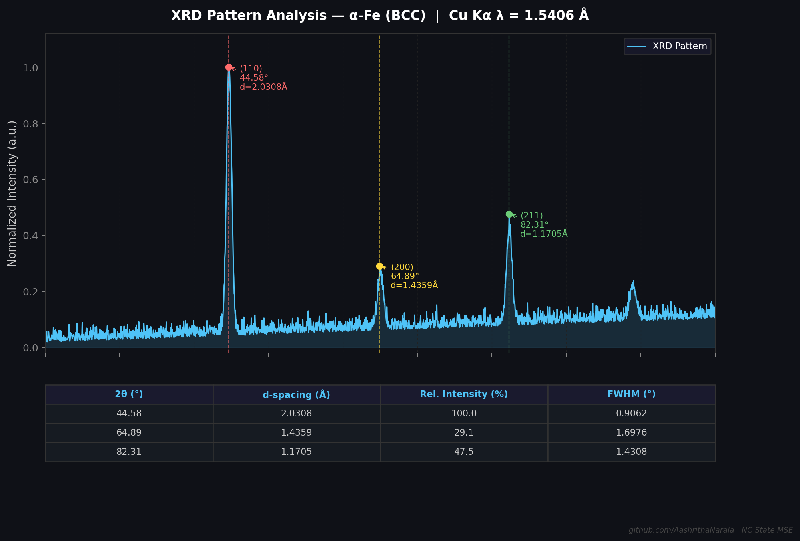

# XRD Peak Analyzer

Built this as my first Python project at NC State. Used synthetic iron XRD data to test it.

**Automated XRD pattern analysis using Bragg's Law - built for materials scientists.**

A Python tool that detects diffraction peaks, calculates d-spacings, fits Gaussian profiles, and generates clean plots. 

---

## What it does

- Detects XRD peaks automatically using scipy signal processing
- Calculates **d-spacing** for each peak using Bragg's Law: `nλ = 2d·sinθ`
- Fits **Gaussian profiles** to extract FWHM (crystallite size analysis ready)
- Generates a **dark-theme labeled output plot** with peak labels and results table
- Exports peak data to CSV

## Output



---

## What I used

- Python 3.x
- NumPy, Pandas, Matplotlib, SciPy

## Installation

```bash
git clone https://github.com/AashrithaNarala/xrd-peak-analyzer
cd xrd-peak-analyzer
pip install numpy pandas matplotlib scipy
python xrd_analyzer.py
```

## Using your own data

Replace the `generate_iron_xrd()` call with:

```python
df = pd.read_csv('your_data.csv')  # columns: two_theta, intensity
two_theta = df['two_theta'].values
intensity = df['intensity'].values
```

## Physics background

Bragg's Law relates the diffraction angle to the interplanar spacing:

```
nλ = 2d·sin(θ)
d = λ / (2·sin(θ))
```

Where λ = 1.5406 Å for Cu Kα radiation (default).

---

**Author:** Aashritha Narala | MS Materials Science & Engineering, NC State University  
**Research interests:** Computational materials, materials informatics, semiconductor materials
